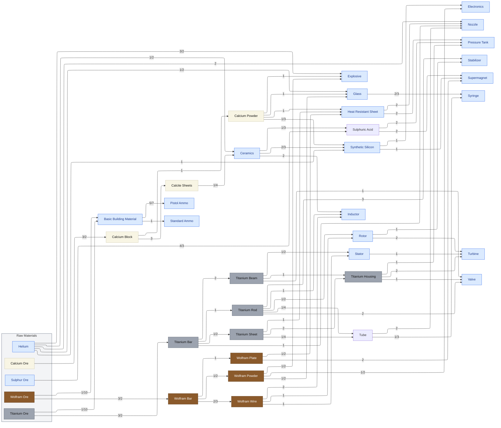

# StarRupture Resource Construction Tree

```mermaid
%%{init: {
  "flowchart": {
    "defaultRenderer": "elk",
    "nodeSpacing": 50,
    "rankSpacing": 90
  }
}}%%
flowchart LR

  %% =====================
  %% RAW MATERIALS (LEFT)
  %% =====================
  subgraph Raw_Materials["Raw Materials"]
    direction TB
    Wolfram_Ore["Wolfram Ore"]
    Titanium_Ore["Titanium Ore"]
    Calcium_Ore["Calcium Ore"]
    Sulphur_Ore["Sulphur Ore"]
    Helium["Helium"]
  end

  %% =====================
  %% OTHER NODES
  %% =====================
  Basic_Building_Material["Basic Building Material"]
  Calcite_Sheets["Calcite Sheets"]
  Calcium_Block["Calcium Block"]
  Calcium_Powder["Calcium Powder"]
  Ceramics["Ceramics"]
  Electronics["Electronics"]
  Explosive["Explosive"]
  Glass["Glass"]
  Heat_Resistant_Sheet["Heat Resistant Sheet"]
  Inductor["Inductor"]
  Nozzle["Nozzle"]
  Pistol_Ammo["Pistol Ammo"]
  Pressure_Tank["Pressure Tank"]
  Rotor["Rotor"]
  Stabilizer["Stabilizer"]
  Standard_Ammo["Standard Ammo"]
  Stator["Stator"]
  Sulphuric_Acid["Sulphuric Acid"]
  Supermagnet["Supermagnet"]
  Synthetic_Silicon["Synthetic Silicon"]
  Syringe["Syringe"]
  Titanium_Bar["Titanium Bar"]
  Titanium_Beam["Titanium Beam"]
  Titanium_Housing["Titanium Housing"]
  Titanium_Rod["Titanium Rod"]
  Titanium_Sheet["Titanium Sheet"]
  Tube["Tube"]
  Turbine["Turbine"]
  Valve["Valve"]
  Wolfram_Bar["Wolfram Bar"]
  Wolfram_Plate["Wolfram Plate"]
  Wolfram_Powder["Wolfram Powder"]
  Wolfram_Wire["Wolfram Wire"]

  %% =====================
  %% EDGES
  %% =====================
  Titanium_Ore -->|3/2| Titanium_Bar
  Wolfram_Ore -->|3/2| Wolfram_Bar
  Calcium_Ore -->|3/2| Calcium_Block
  Calcium_Block -->|1| Calcium_Powder
  Calcium_Block -->|3| Calcite_Sheets

  Wolfram_Bar -->|1/2| Wolfram_Powder
  Wolfram_Bar -->|1| Wolfram_Plate
  Wolfram_Bar -->|2/3| Wolfram_Wire

  Calcite_Sheets -->|1/4| Ceramics
  Helium -->|1/2| Ceramics

  Wolfram_Powder -->|1/2| Glass
  Calcium_Powder -->|1| Glass
  Helium -->|1/2| Glass

  Titanium_Bar -->|2| Titanium_Beam
  Titanium_Bar -->|1| Titanium_Rod
  Titanium_Bar -->|1/2| Titanium_Sheet

  Titanium_Beam -->|1| Titanium_Housing
  Titanium_Sheet -->|2| Titanium_Housing

  Calcium_Powder -->|1| Explosive
  Wolfram_Powder -->|1/2| Explosive
  Helium -->|3/2| Explosive

  Wolfram_Plate -->|1/2| Heat_Resistant_Sheet
  Titanium_Sheet -->|1| Heat_Resistant_Sheet
  Calcium_Powder -->|1| Heat_Resistant_Sheet

  Calcium_Powder -->|1/3| Synthetic_Silicon
  Helium -->|1| Synthetic_Silicon
  Ceramics -->|2/3| Synthetic_Silicon

  Sulphur_Ore -->|4/3| Sulphuric_Acid
  Ceramics -->|1/3| Sulphuric_Acid

  Sulphuric_Acid -->|2| Supermagnet
  Wolfram_Plate -->|2| Supermagnet
  Synthetic_Silicon -->|1| Supermagnet

  Wolfram_Ore -->|1/10| Basic_Building_Material
  Titanium_Ore -->|1/10| Basic_Building_Material

  Titanium_Rod -->|1/2| Rotor
  Wolfram_Wire -->|1| Rotor

  Titanium_Rod -->|1/4| Tube
  Titanium_Sheet -->|1/4| Tube

  Rotor -->|1| Stabilizer
  Titanium_Rod -->|3| Stabilizer

  Titanium_Beam -->|1/2| Stator
  Wolfram_Wire -->|1| Stator

  Synthetic_Silicon -->|1| Electronics
  Wolfram_Powder -->|1/2| Electronics

  Basic_Building_Material -->|5/7| Pistol_Ammo
  Basic_Building_Material -->|1| Standard_Ammo

  Tube -->|1/3| Syringe
  Glass -->|2/3| Syringe

  Titanium_Rod -->|1| Inductor
  Wolfram_Wire -->|2| Inductor
  Ceramics -->|2| Inductor

  Titanium_Housing -->|1| Valve
  Titanium_Beam -->|1| Valve
  Titanium_Rod -->|2| Valve

  Titanium_Housing -->|2| Turbine
  Stator -->|1| Turbine
  Rotor -->|2| Turbine

  Heat_Resistant_Sheet -->|2| Nozzle
  Tube -->|2| Nozzle
  Titanium_Bar -->|1| Nozzle
  Helium -->|2| Nozzle

  Heat_Resistant_Sheet -->|2| Pressure_Tank
  Titanium_Housing -->|1| Pressure_Tank
  Sulphuric_Acid -->|2| Pressure_Tank

  %% =====================
  %% COLOUR DEFINITIONS
  %% =====================
  classDef wolfram fill:#8b5a2b,stroke:#5a3a1a,color:#ffffff;
  classDef titanium fill:#9ca3af,stroke:#4b5563,color:#111111;
  classDef calcium fill:#f8f5e4,stroke:#c9c3a6,color:#111111;
  classDef mixed fill:#dbeafe,stroke:#2563eb,color:#1e3a8a;

  %% =====================
  %% CLASS ASSIGNMENTS
  %% =====================
  class Wolfram_Ore,Wolfram_Bar,Wolfram_Plate,Wolfram_Powder,Wolfram_Wire wolfram;
  class Titanium_Ore,Titanium_Bar,Titanium_Beam,Titanium_Rod,Titanium_Sheet,Titanium_Housing titanium;
  class Calcium_Ore,Calcium_Block,Calcium_Powder,Calcite_Sheets calcium;
  class Helium,Sulphur_Ore mixed;

  class Ceramics,Glass,Explosive,Heat_Resistant_Sheet,Synthetic_Silicon,Supermagnet mixed;
  class Electronics,Inductor,Valve,Nozzle,Pressure_Tank,Syringe,Turbine,Stator,Rotor,Stabilizer mixed;
  class Basic_Building_Material,Pistol_Ammo,Standard_Ammo mixed;

  %% =====================
  %% SUBGRAPH STYLING
  %% =====================
  style Raw_Materials fill:#f3f4f6,stroke:#9ca3af,stroke-width:2px;

```
