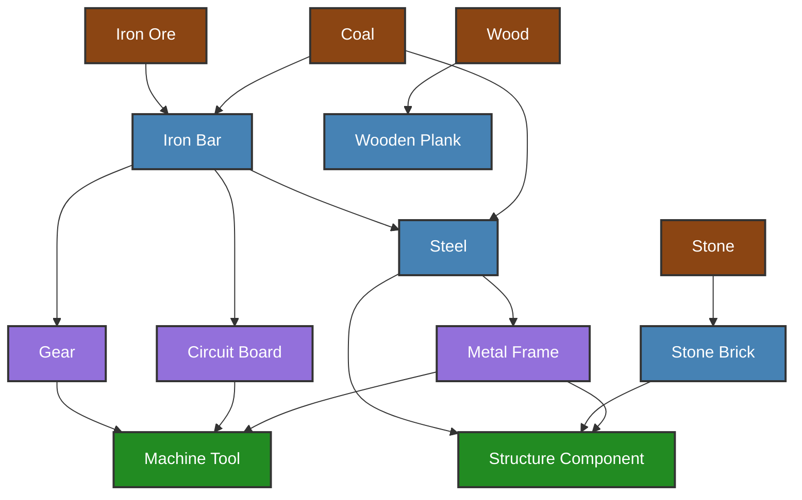

# Starrupture Construction Tree

This repository contains a mermaid diagram showing the construction tree and resource dependencies for building items in Starrupture.

## Construction Flow Diagram

The following diagram shows the resources and dependencies required to construct various items in Starrupture. Each node represents a resource or craftable item, and the arrows indicate what materials are needed to create each item.

## How to Update

To update this diagram with the correct Starrupture construction tree:

1. Edit the README.md file
2. Update the mermaid diagram within the \`\`\`mermaid code block
3. Add/remove nodes to represent actual in-game items and resources
4. Update the arrows (-->) to show the correct crafting dependencies
5. Adjust the style classes if needed to categorize different types of items

## Mermaid Syntax Reference

- `NodeName[Display Text]` - Creates a node with a label
- `A --> B` - Creates an arrow from A to B (A is required to build B)
- `A --> B --> C` - Chain multiple dependencies
- `%% Comment` - Add comments in the diagram
- Style nodes using `classDef` and `class` declarations

## Contributing

Feel free to improve the diagram or suggest additions. This is a community resource under CC0 1.0 Universal license.

## License

This work is marked with CC0 1.0 Universal. See the [LICENSE](LICENSE) file for details.
